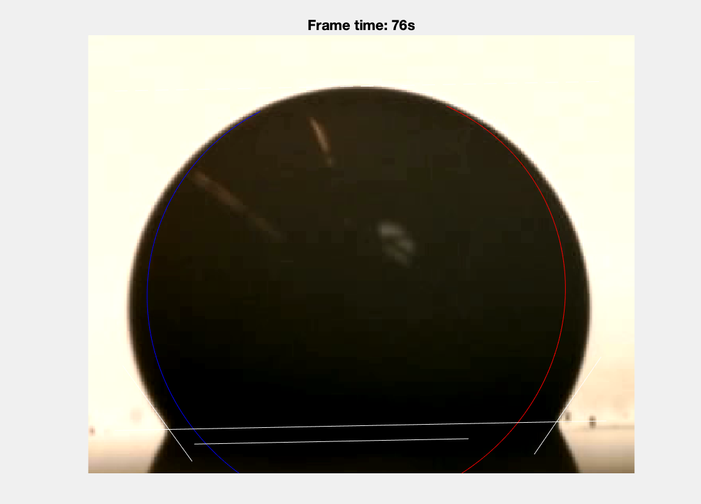

# Sessile-Droplet-analysis


#### Requirements
- Matlab (originally written in 2018a)
- image_toolbox
- statistics_toolbox

#### Installation
- [droplet(Im, rect, estimate, baseline)](droplet.m) calls the droplet class that analyzes the shape of a sessile droplet resting on a droplet using either a spherical or eliptical approximation to determine the size and contact angle.
Im is an image of the droplet centered in rectangle rect. estimate is a size estimation for the radius of the droplet in pixels (the radius range is set to 90-110% of estimate). baseline is a vector containing two points describing the edge of the surface the droplet is resting on.
- [fit_ellipse(x,y,axis_handle)](fit_ellipse.m) was adopted from [Ohad Gal](https://www.mathworks.com/matlabcentral/fileexchange/3215-fit_ellipse). x,y are a set of points in 2 column vectors. axis_handle is an optional handle to an axis, at which the estimated ellipse will be drawn along with it's axes.
- [DropletAnalysis](DropletAnalysis.m) takes a video of a sessile droplet evaporating in place and tracks the shape and size of the droplet.

To install: 
```shell 
git clone https://github.com/soerenbrandt/Sessile-Droplet-analysis.git
```

#### Application:
We tracked the evaporation of droplets resting on a flat substrate. DropletAnalysis uses a video recorded at 1 FPS and measures the size and shape in each frame. The results can be saved as a video and csv file.

#### Tutorial:
1. When DropletAnalysis.m is called, a video can be loaded into a prompt.
    - The user can set analyzed video frames to be shown during the analysis
    - DropletAnalysis uses the elliptical approximation by default.
2. THe user can select to plot a video of the analysis (e.g. see [example](Video.mp4))


